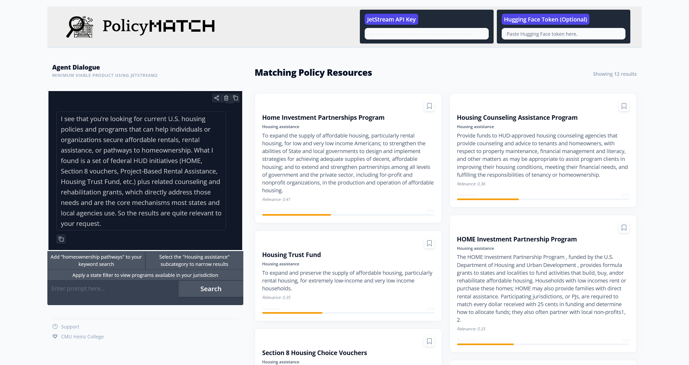

# PolicyMatch



An LLM-enabled, RAG-powered policy search tool. PolicyMatch lets policy analysts and mission-driven organizations find existing programs and policies through natural language queries, reducing the research burden of identifying relevant precedents across government, nonprofit, and for-profit sectors.

**Course:** 90803-B: Machine Learning Foundations with Python — CMU Heinz College  
**Team:** Gavin Loyd, Cierra Oliveira, Avery Trinidad

---

## Requirements

### API Access

| Key | Purpose | Required |
|-----|---------|----------|
| JetStream2 API Key | Powers the LLM pipeline (gpt-oss-120b via Indiana University) | Yes |
| Hugging Face Token | Model download auth for `all-MiniLM-L6-v2` | No |

*JetStream2 API Key available to [NSF ACCESS](https://access-ci.org/) participating organizations.*

### Python Packages

```
pandas
numpy
gradio
sentence-transformers
openai
chromadb
```

To install all at once:

```bash
pip install pandas numpy gradio sentence-transformers openai chromadb
```

### Data

PolicyMatch requires a pre-built ChromaDB collection labeled `policymatch` located at `./chroma_db` relative to the working directory. The collection is built from two sources (April 2026 editions):

- **Results First Clearinghouse Database** — 4,000+ social policy programs across education, public health, and other arenas
- **Federal Programs Inventory (OMB)** — federal financial assistance programs with spending and performance data from 2023–2025

This collection is included in the repository.

---

## Running the App

```bash
python policymatch.py
```

Gradio will launch a local web interface. Paste your JetStream2 API key into the nav bar before searching. The Hugging Face token field is optional and only needed if your environment requires authenticated model downloads.

---

## Features

- **Semantic search** over 6,000+ policy programs using vector embeddings (`all-MiniLM-L6-v2` + ChromaDB)
- **Agentic query pipeline** — the LLM rewrites user queries for vector search, assesses relevance, and generates a conversational response
- **Rolling conversational memory** — the agent retains thematic context across queries within a session
- **Misuse detection** — distinguishes between accidental misuse and adversarial inputs; blocks and explains appropriately
- **Result cards** — each result shows program name, subcategory, description, and a relevance score
- **Suggestion chips** — three actionable follow-up prompts are generated after each search to help users refine their query
- **Collection bin** — save up to 6 programs per session for reference

---

## Agentic Pipeline

Each search triggers a seven-step pipeline:

1. **Query Reinterpretation** — rewrites the user query for vector search; flags misuse or malintent
2. **RAG Retrieval** — embeds the rewritten query and retrieves the top 12 results from ChromaDB
3. **Relevance Judgment** — scores the retrieved results against the original query (0.0–1.0)
4. **User-Facing Explainer** — generates the chatbot response shown to the user
5. **Theme Extraction** — identifies 3 emerging themes from the query and results
6. **Rolling Memory Update** — synthesizes conversation history into a 4-sentence context summary passed into the next call
7. **Suggestion Chips** — generates 3 follow-up query suggestions as actionable phrases

---

## Limitations

- **No time filtering** — most records lack standardized date fields, so timeframe-based queries are unsupported
- **Inconsistent geographic precision** — performance varies by geographic scale; city-level queries (e.g., "Harlem") outperform state-level ones (e.g., "Alabama") due to inconsistent tagging across data sources
- **No sector filter** — governmental vs. NGO program distinctions are inferred by the LLM rather than enforced by pre-existing metadata
- **Federal/state bias** — the tool performs best on federal and state-level queries; hyperlocal edge cases are less reliably covered
